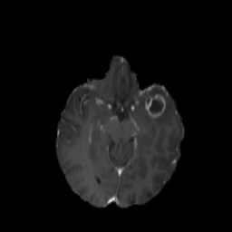
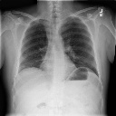

# YOLOv7 for Medical Imaging: Brain Tumor & Pneumonia Detection

This repository contains the complete implementation for a research project that reproduces and extends the YOLOv7 object detection framework for two distinct medical imaging tasks: brain tumor detection in MRI scans and pneumonia detection in chest X-rays.

***

## 📂 Project Structure

The project is organized into two main parts, each corresponding to a phase of the research:

* **`1_Brain_Tumor_Reproduction/`**: Contains the code and results for the baseline experiment, reproducing the paper's methodology on a brain tumor MRI dataset.
* **`2_Pneumonia_Extension/`**: Contains the code and results for the extension experiment, adapting the YOLOv7 framework to a new domain of pneumonia detection from chest X-rays.

Each folder contains:
* A `results/` subdirectory with sample output images showing successful detections.
* The complete Jupyter/Colab notebook (`.ipynb`) with all the code for data setup, training, and inference.

***

## 🚀 Part 1: Reproduction of Brain Tumor Detection

This phase focused on validating the YOLOv7 framework on a medical dataset. A model was trained for 50 epochs on a pre-formatted brain tumor MRI dataset from Kaggle.

* **To see the full process:** Open the notebook located in `1_Brain_Tumor_Reproduction/`.
* **Dataset Used:** [Brain Tumor Detection (YOLO format)](https://www.kaggle.com/datasets/davidbroberts/brain-tumor-object-detection-datasets)

### Sample Result

***

## 🔬 Part 2: Extension to Pneumonia Detection

To demonstrate the versatility of the framework, it was applied to a new challenge: detecting pneumonia in chest X-rays. This required adapting the model to a different imaging modality and pathology. A quick proof-of-concept was trained for 2 epochs.

* **To see the full process:** Open the notebook located in `2_Pneumonia_Extension/`.
* **Dataset Used:** [RSNA Pneumonia Detection (YOLO format)](https://www.kaggle.com/datasets/volodymyrmakhotilo/rsna-pneumonia-detection-challenge-yolo)

### Sample Result

***

## 🛠️ How to Run

1.  **Choose an experiment folder** (either brain tumor or pneumonia).
2.  **Download the required dataset** from the Kaggle link provided.
3.  **Open the `.ipynb` notebook** from the chosen folder in Google Colab.
4.  **Set the runtime to GPU** (`Runtime > Change runtime type > GPU`).
5.  **Run the cells** in the notebook. You will be prompted to upload the dataset `.zip` file.
